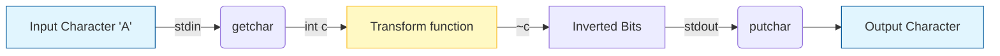
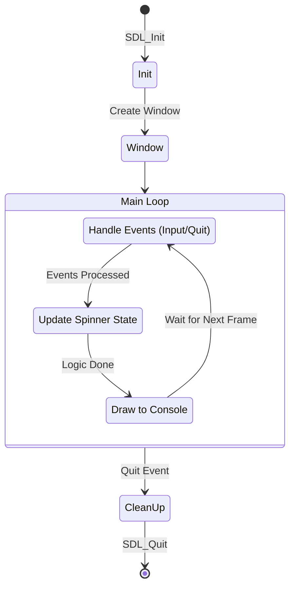
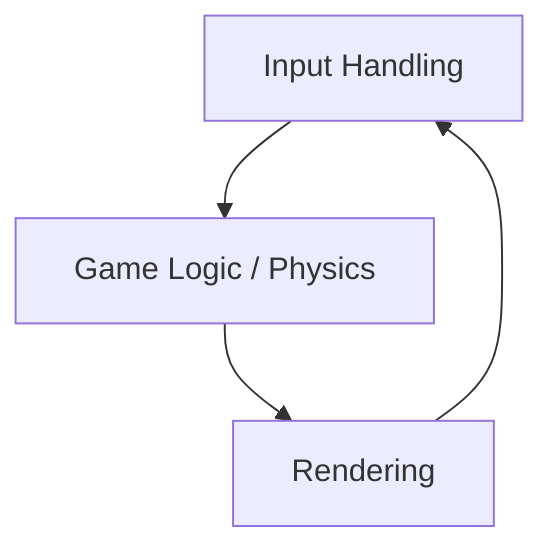
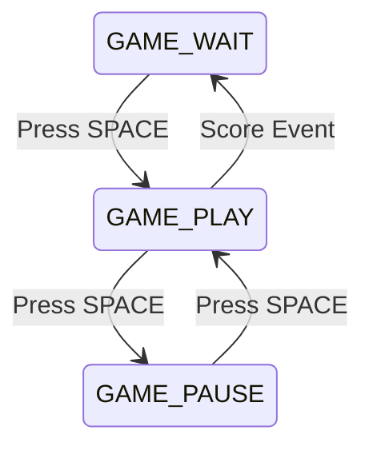
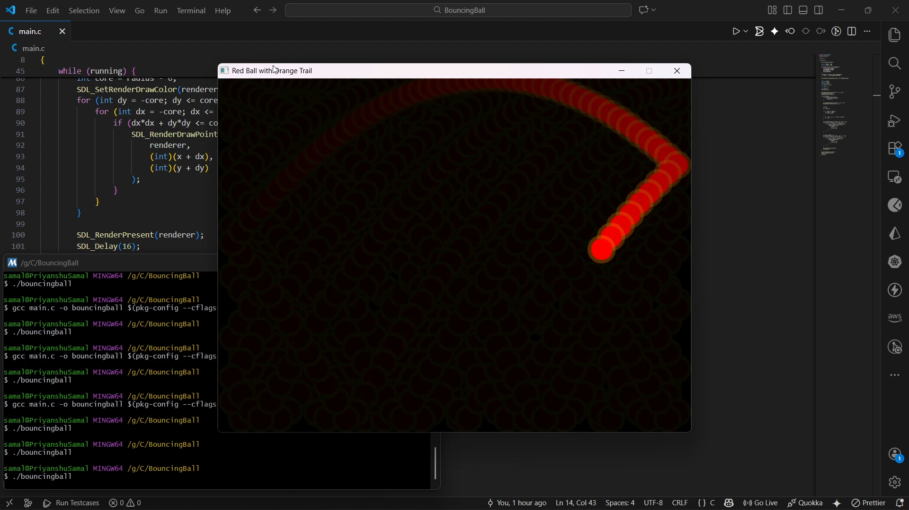
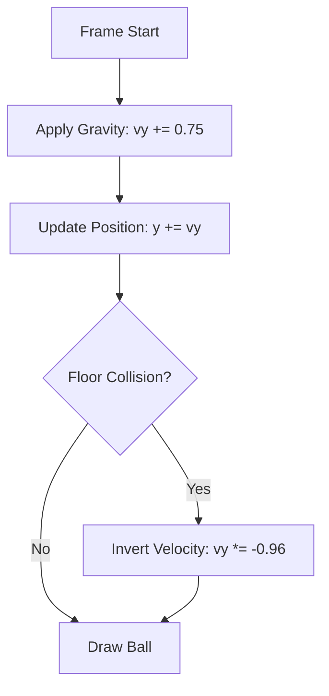
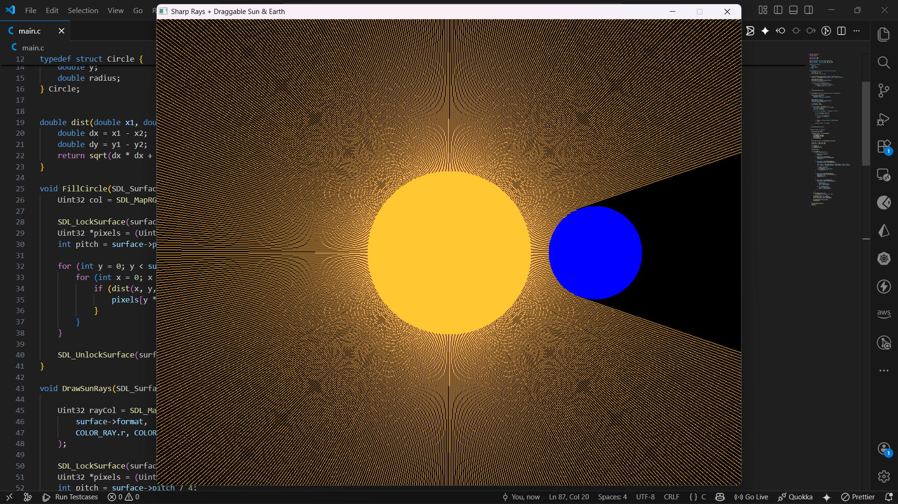
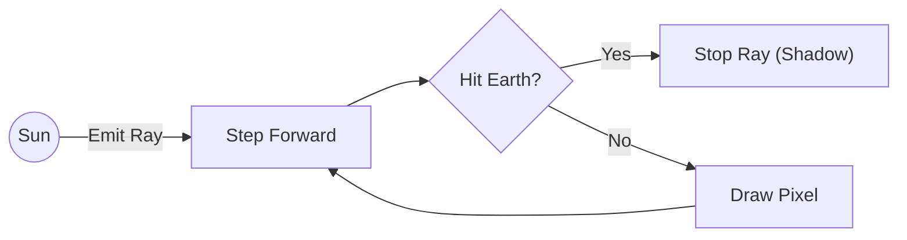
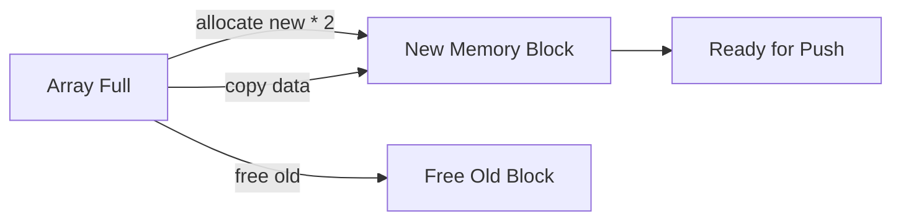
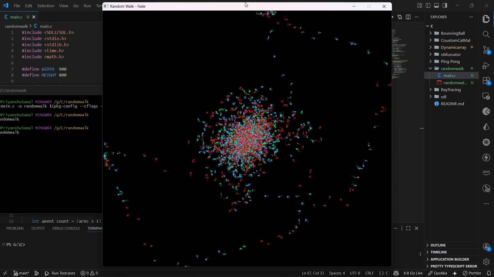

# C Learning Journey

Welcome to my C programming repository. This "book" documents my journey of learning C through practical projects. Each chapter dives into a specific project, explaining the concepts, code, and logic behind it.

## Index

*   [**Chapter 1: The Obfuscator**](./obfuscator) - A simple tool to scramble text using bitwise operations.
*   [**Chapter 2: SDL Experiment**](./sdl) - An exploration of graphics programming and window management.
*   [**Chapter 3: Ping Pong**](./Ping%20Pong) - A classic Pong game implemented from scratch.
*   [**Chapter 4: Bouncing Ball**](./BouncingBall) - Gravity simulation with visual trail effects.
*   [**Chapter 5: Ray Casting**](./RayTracing) - 2D dynamic shadow casting with interactive light source.
*   [**Chapter 6: Custom Allocator**](./CoustomCalMal) - A manual memory allocator from scratch using `VirtualAlloc`.
*   [**Chapter 7: Dynamic Array**](./Dynamicarray) - An implementation of a resizeable array (Vector) in C.
*   [**Chapter 8: Random Walk**](./randomwalk) - A visualization of 2000 agents moving randomly with trail effects.

---

## Chapter 1: The Obfuscator

### Overview
The **Obfuscator** is a minimal utility designed to understand how data can be manipulated at the bit level. It takes standard input, flips the bits of every character, and prints the result to standard output. This simple transformation makes the text unreadable to humans but easily reversible by running it through the same program again.

### Concept
This program demonstrates two core concepts:
1.  **Standard I/O**: Reading from `stdin` and writing to `stdout` allows the program to be part of a pipeline (e.g., `echo "hello" | ./main`).
2.  **Bitwise NOT (`~`)**: The tilde operator inverts all bits of a number. (e.g., `00001111` becomes `11110000`).

### Data Flow
The following diagram illustrates how a single character flows through the program:



### Code Walkthrough
Let's look at `obfuscator/main.c` line by line.

```c
1: #include <stdio.h>
```
**Line 1**: We include the Standard Input/Output library. This gives us access to `getchar`, `putchar`, and `EOF`.

```c
2:  int transform(int c){
3:     return ~c;
4:  }
```
**Lines 2-4**: The `transform` function is the core logic.
*   It takes an integer `c` (a character code).
*   It returns `~c` (bitwise NOT of `c`).
*   **Why `int`?** In C, `getchar` returns an `int` to accommodate the `EOF` (End of File) marker, which is -1.

```c
6:  int main(){
7:     int c;
8:     while((c=getchar()) != EOF){
9:         putchar(transform(c));
10:     }
11:  }
```
**Line 6**: The entry point of the program.
**Line 7**: We declare a variable `c` to hold each character.
**Line 8**: This is a classic C idiom: `while((c=getchar()) != EOF)`.
1.  `getchar()` reads one character from the input.
2.  `(c = ...)` assigns that character to `c`.
3.  `... != EOF` checks if we have reached the end of the input stream.
4.  The loop continues as long as there is data to read.
**Line 9**: `putchar(transform(c))` calculates the obfuscated character and prints it immediately.

---

## Chapter 2: SDL Starter

### Overview
This project is an initial experiment with **SDL2** (Simple DirectMedia Layer). Unlike the console-based obfuscator, this program creates a graphical window. However, since it's a "starter" project, it also keeps a foot in the terminal world by running an ASCII spinner in the console while the window is open.

### Application Loop
Game engines and UI applications typically run in an infinite loop that handles events, updates state, and renders graphics.



### Key Components (`sdl/main.c`)

*   **SDL Initialization**: `SDL_Init(SDL_INIT_VIDEO)` sets up the video subsystem.
*   **Window Creation**: `SDL_CreateWindow` opens the actual OS window with the title "ASCII Spinner".
*   **The Event Loop**:
    ```c
    while (SDL_PollEvent(&event)) {
        if (event.type == SDL_QUIT) { ... }
    }
    ```
    This non-blocking loop checks for user actions (like clicking the 'X' button) to ensure the application stays responsive.
*   **The Spinner**: The code manually refreshes the console output using ANSI escape codes (`\033[2J\033[H`) to clear the screen and print the next frame of the animation, creating a simple visual effect in the terminal alongside the empty SDL window.

---

## Chapter 3: Ping Pong

[**View Gameplay Demo on X**](https://x.com/PriyanshuS92042/status/2001981221052858504?s=20)

### Overview
**Pong in C using SDL2** is a classic Pong game implemented from scratch. This project was built to deeply understand low-level memory manipulation, pointers, real-time game loops, collision physics, and state-driven architecture.


### Features
*   **Two-player Pong** (keyboard controlled)
*   **Start / Pause / Resume** game
*   **Restart** game with score reset
*   **Constant-speed ball physics** (no speed bugs)
*   **Proper collision handling** (walls & paddles)
*   **Text rendering** using SDL2_ttf
*   **Clean game-state architecture**

### Controls
| Key | Action |
| :--- | :--- |
| **W / S** | Player 1 paddle up / down |
| **↑ / ↓** | Player 2 paddle up / down |
| **SPACE** | Start / Pause / Resume |
| **X** | Restart game (reset score) |
| **ESC** | Quit |

### High-Level Architecture
The game is structured into three core phases, executed every frame. This separation ensures input doesn’t directly affect rendering and physics doesn’t run when paused.



### Game State System
The game uses a state machine to control behavior:



*   **GAME_WAIT**: Ball is reset, waiting to start.
*   **GAME_PLAY**: Physics and movement active.
*   **GAME_PAUSE**: Screen frozen, input still active.

### Technical Deep Dive
#### Memory & Pointer Design
This project intentionally uses **pointers** everywhere movement or state must persist.

```c
void move_paddle(SDL_Rect *p, int dy)
```

Passing by **value** would modify a copy. Passing a **pointer** modifies the actual object in memory. This is how real engines work at a low level: nothing "moves" on screen; numbers in memory change, and SDL draws those numbers.

#### Physics (Ball Movement)
The ball uses float-based velocity vectors to prevent speed bugs and inconsistent gameplay.


1.  **Angle Calculation**: Calculated based on where the ball hits the paddle.
2.  **Normalization**: The velocity vector is normalized.
3.  **Constant Speed**: Speed magnitude is restored to a constant value.

### File Structure
```
Ping Pong/
├── main.c        # Entire game logic
├── arial.ttf     # Font used for score rendering
├── pingpong.png  # Gameplay screenshot
└── pingpong.exe  # Generated buffer
```

### How to Build & Run (Step-by-Step)
**Windows (MSYS2 – MinGW64)**

1.  **Install dependencies**
    ```bash
    pacman -S mingw-w64-x86_64-SDL2 mingw-w64-x86_64-SDL2_ttf
    ```

2.  **Navigate to project folder**
    ```bash
    cd "Ping Pong"
    ```

3.  **Compile**
    ```bash
    gcc main.c -o pingpong $(pkg-config --cflags --libs sdl2 SDL2_ttf) -lm
    ```

4.  **Run**
    ```bash
    ./pingpong
    ```

> [!WARNING]
> Ensure `arial.ttf` is in the same folder as the executable, otherwise the game may not load the font.

---

## Chapter 4: Bouncing Ball

[**View Gameplay Demo on X**](https://x.com/PriyanshuS92042/status/2002752477947724057?s=20)

### Overview
**Bouncing Ball** is a physics simulation that models gravity and momentum. It renders a red ball that accelerates downwards, bounces off the floor with energy loss (restitution), and leaves a fading orange trail to visualize its path.



### Key Concepts

#### 1. Gravity & Physics
The simulation uses a simple Euler integration method:
*   **Gravity**: Constant acceleration added to velocity every frame.
*   **Restitution**: When hitting the floor, velocity is inverted and multiplied by `0.96f` to simulate energy loss (damping).



#### 2. Trail Effect (Visuals)
Instead of clearing the screen completely with black, we draw a semi-transparent black rectangle over the previous frame.
```c
SDL_SetRenderDrawColor(renderer, 0, 0, 0, 14); // Low alpha
SDL_RenderFillRect(renderer, NULL);
```
This causes previous positions of the ball to slowly fade out, creating a smooth "motion blur" or trail effect without storing a history of positions.

### Code Highlights (`BouncingBall/main.c`)

**Drawing the Circle (Manual Rasterization)**
Since SDL2 doesn't have a built-in `FillCircle`, we use the circle equation $x^2 + y^2 \le r^2$:
```c
for (int dy = -radius; dy <= radius; dy++) {
    for (int dx = -radius; dx <= radius; dx++) {
        if (dx*dx + dy*dy <= radius*radius) {
            SDL_RenderDrawPoint(renderer, x + dx, y + dy);
        }
    }
}
```

### How to Build & Run
**Windows (MSYS2 – MinGW64)**

1.  **Navigate to project folder**
    ```bash
    cd "BouncingBall"
    ```

2.  **Compile**
    ```bash
    gcc main.c -o bouncingball $(pkg-config --cflags --libs sdl2)
    ```

3.  **Run**
    ```bash
    ./bouncingball
    ```

---

## Chapter 5: Ray Casting

[**View Gameplay Demo on X**]()

### Overview
**Sharp Rays** is a 2D ray casting engine that demonstrates dynamic lighting and shadows. Unlike standard rasterization, this project casts hundreds of rays from a light source (the "Sun") in all directions. When a ray hits an object (the "Earth"), it stops, creating a shadow behind the object. The simulation renders these rays in real-time, allowing you to drag the Sun and Earth to see the shadows shift instantly.



### Key Concepts

#### 1. Ray Casting Algorithm
For every frame, the engine emits 720 rays (one every 0.5 degrees) from the center of the Sun.
*   **Step**: Each ray marches forward pixel by pixel.
*   **Collision**: If a ray hits the Earth (distance < radius) or the screen edge, it stops.
*   **Rendering**: Pixels along the ray's path are colored, creating a beam of light.



#### 2. Interactive Geometry
The project handles mouse input to update the coordinates of the `Circle` structs for the Sun and Earth. This requires re-calculating all ray interactions every frame, showcasing the efficiency of direct pixel manipulation in C.

### Code Highlights (`RayTracing/main.c`)

**The Ray Marching Loop**
```c
for (int i = 0; i < ray_count; i++) {
    double angle = (2.0 * M_PI * i) / ray_count;
    double dx = cos(angle);
    double dy = sin(angle);

    for (double t = sun.radius; t < max_len; t += 1.0) {
        int x = (int)(sun.x + dx * t);
        int y = (int)(sun.y + dy * t);
        
        // Stop if we hit the Earth (Simple Shadow Logic)
        if (dist(x, y, earth.x, earth.y) <= earth.radius)
            break;

        pixels[y * pitch + x] = rayCol;
    }
}
```

### Controls
*   **Left Click & Drag**: Move the Sun (Yellow) or Earth (Blue).
*   **ESC**: Quit the application.

### How to Build & Run
**Windows (MSYS2 – MinGW64)**

1.  **Navigate to project folder**
    ```bash
    cd "RayTracing"
    ```

2.  **Compile**
    ```bash
    gcc main.c -o raytracing $(pkg-config --cflags --libs sdl2) -lm
    ```

3.  **Run**
    ```bash
    ./raytracing
    ```

---

## Chapter 6: Custom Allocator

### Overview
This project builds a **custom memory allocator** from scratch on Windows. It avoids the standard C runtime heap (`malloc`/`free`) to interact directly with the OS kernel via `VirtualAlloc`. This is a deep dive into systems programming, understanding how memory managers work under the hood.

### Part 1: Line-by-Line Explanation

#### Headers and Macros
```c
#define WIN32_LEAN_AND_MEAN
#include <windows.h>
#include <stdint.h>
```
*   **`WIN32_LEAN_AND_MEAN`**: Tells Windows headers to skip legacy APIs, reducing compile time and pollution.
*   **`windows.h`**: Gives access to `VirtualAlloc`, `VirtualFree`, and OS types. This is the **OS boundary**.
*   **`stdint.h`**: Provides fixed-width integers like `uint64_t` for precise memory control.

#### Allocator Configuration
```c
#define ARENA_SIZE (1024 * 1024)
#define ALIGNMENT 8
```
*   **`ARENA_SIZE`**: We request a 1 MB private heap from the OS.
*   **`ALIGNMENT 8`**: x64 CPUs prefer 8-byte alignment. Misalignment causes performance hits or crashes.

#### Block Metadata (The Heart of `malloc`)
```c
typedef struct Block {
    size_t size;
    int free;
    struct Block* next;
} Block;
```
This structure is **bookkeeping**. It sits *before* the memory you get.
*   **`size`**: Usable memory size (excluding header).
*   **`free`**: 1 if available, 0 if used.
*   **`next`**: Points to the next block in our linked list.

#### Initialization (`VirtualAlloc`)
```c
arena = VirtualAlloc(NULL, ARENA_SIZE, MEM_RESERVE | MEM_COMMIT, PAGE_READWRITE);
```
*   **`MEM_RESERVE`**: Reserves virtual address space.
*   **`MEM_COMMIT`**: Actually allocates physical memory (or swap).
*   **Critical**: If this fails, the program crashes immediately. We cannot recover.

---

### Step-by-Step Execution Model

We’ll walk through this allocator as if we are single-stepping it in a debugger, with real numbers, real addresses, and clear accept/reject conditions.

**Assumptions**:
*   `ARENA_SIZE` = 1024 bytes
*   `sizeof(Block)` = 24 bytes
*   Alignment = 8
*   Arena base address = `0x1000`

#### Step 0: Initial State
```c
static void* arena = NULL;
static Block* free_list = NULL;
```
Nothing exists yet.

#### Step 1: First call: `my_malloc(100)`

**Step 1: Lazy Init**
`arena` is NULL, so `init_allocator()` runs. `VirtualAlloc` gives memory at `0x1000`.
*   **free_list**: `0x1000`
*   **Size**: 1024 - 24 = 1000
*   **Free**: 1

**Memory Layout:**
```
0x1000 ┌────────────────────────────┐
       │ Block header (size=1000)   │
0x1018 ├────────────────────────────┤
       │ free memory (1000 bytes)   │
       │                            │
       └────────────────────────────┘
```

**Step 2: Alignment**
`size = ALIGN(100)`
`(100 + 7) & ~7` = 104.
Requested size is **104**.

**Step 3: Traverse & Split**
*   **Check**: `curr->free` (1) is True AND `curr->size` (1000) >= 104. **ACCEPTED**.
*   **Split Check**: 1000 >= 104 (size) + 24 (header) + 8 (alignment) = 136. **Yes**.
*   **Splitting logic**:
    *   **New Block B** created at `0x1080` (`0x1000` + 24 + 104).
    *   **Block A** shrinks to 104 bytes.

**Memory after split:**
```
0x1000 ┌─────────────┐
       │ Block A     │ size=104, used
0x1018 ├─────────────┤
       │ user data   │ (104 bytes)
0x1080 ├─────────────┤
       │ Block B     │ size=872, free
0x1098 ├─────────────┤
       │ free memory │
       └─────────────┘
```
**Return**: `0x1018` (User gets pointer to data).

#### Step 2: Second call: `my_malloc(200)`
1.  **Align**: `ALIGN(200)` = 200.
2.  **Traverse**:
    *   Block A (`0x1000`): `free=0` → **REJECTED**.
    *   Block B (`0x1080`): `free=1`, `size=872` >= 200. **ACCEPTED**.
3.  **Split**: 872 >= 200 + 24 + 8. Yes.
    *   New Block C created at `0x1160` (`0x1098` + 200).
    *   Block B becomes Used (200), Block C is Free (648).

#### Step 3: Third call: `my_malloc(50)`
1.  **Align**: `ALIGN(50)` = 56.
2.  **Traverse**: A (Used) → B (Used) → C (Free, 648 >= 56). **ACCEPTED**.
3.  **Split**: New Block D created.

**Current Layout**: `[A used] [B used] [C used] [D free]`

#### Step 4: Freeing: `my_free(b)`
1.  Get header from pointer (`0x1098` - 24 = `0x1080`).
2.  Mark `free = 1`.
3.  **Coalesce**:
    *   A (Used) + B (Free) → Skip.
    *   B (Free) + C (Used) → Skip.

#### Step 5: Freeing: `my_free(a)`
1.  Mark A `free = 1`.
2.  **Coalesce**:
    *   A (Free) + B (Free) → **MERGE**. A absorbs B.
    *   Size becomes `sizeof(A) + sizeof(Block) + sizeof(B)`.

#### Step 6: Freeing: `my_free(c)`
1.  Mark C `free = 1`.
2.  **Coalesce**: (A+B) is Free, C is Free. **MERGE**.
3.  Result: One giant free block (A+B+C+D).

---

### Logic Summary

**When allocation is REJECTED**
1.  **Block too small**: `curr->size < size`
2.  **Block is used**: `curr->free == 0`
3.  **No block fits**: Returns `NULL`

**When allocation is ACCEPTED**
1.  **Block is free** AND **Size is sufficient**.
2.  **Split Condition**: `curr->size >= size + sizeof(Block) + ALIGNMENT`.
    *   If yes: Split (Shrink current, create new free block).
    *   If no: Use entire block (internal fragmentation).

**Final Mental Model**
*   **malloc**: Scan → Reject Used/Small → Split if possible → Mark Used → Return body.
*   **free**: Jump back to header → Mark Free → Merge neighbors.

---

### Trace Log (Live Debug Output)

We instrumented the code to print every split, allocation, and merge. This trace perfectly matches the logic above.

```text
[INIT] arena=00BC0000 size=1048576

[BLOCK LIST]
Block 0 | header=00BC0000 | user=00BC000C | size=1048564 | free=1 | next=00000000

[MALLOC] request=104
  checking block=00BC0000 | free=1 | size=1048564
  -> ACCEPTED
[SPLIT] block=00BC0000 -> new_block=00BC0074 | sizes: 104 / 1048448
[MALLOC DONE] header=00BC0000 user=00BC000C size=104

[BLOCK LIST]
Block 0 | header=00BC0000 | user=00BC000C | size=104 | free=0 | next=00BC0074
Block 1 | header=00BC0074 | user=00BC0080 | size=1048448 | free=1 | next=00000000

[MALLOC] request=200
  checking block=00BC0000 | free=0 | size=104      
  -> REJECTED
  checking block=00BC0074 | free=1 | size=1048448  
  -> ACCEPTED
[SPLIT] block=00BC0074 -> new_block=00BC0148 | sizes: 200 / 1048236
[MALLOC DONE] header=00BC0074 user=00BC0080 size=200

[BLOCK LIST]
Block 0 | header=00BC0000 | user=00BC000C | size=104 | free=0 | next=00BC0074
Block 1 | header=00BC0074 | user=00BC0080 | size=200 | free=0 | next=00BC0148
Block 2 | header=00BC0148 | user=00BC0154 | size=1048236 | free=1 | next=00000000

[FREE] user=00BC0154 header=00BC0148 size=56
[COALESCE] 00BC0000 + 00BC0148
...
```

### Windows vs Linux (The Brutal Truth)

| Feature | Linux | Windows |
| :--- | :--- | :--- |
| **Heap Growth** | `brk` / `sbrk` (Single linear heap) | **No linear heap**. Use `VirtualAlloc` regions. |
| **Commitment** | Lazy (Overcommit allowed) | Explicit `MEM_COMMIT` required. |
| **System Calls** | `mmap`, `munmap` | `VirtualAlloc`, `VirtualFree` |
| **Tooling** | `strace`, `/proc`, open kernel | `WinDbg`, closed kernel |

> [!TIP]
> **Windows forces you to be precise.** If you can write a correct allocator here, Linux allocators will feel easy.

### How to Build & Run
**Windows (MSYS2 – MinGW64)**

1.  **Navigate to project folder**
    ```bash
    cd "CoustomCalMal"
    ```

2.  **Compile**
    ```bash
    gcc main.c -o custom_allocator
    ```
    *Note: No SDL flag needed. This is pure system C.*

3.  **Run**
    ```bash
    ./custom_allocator
    ```

---

## Chapter 7: Dynamic Array

### Overview
This project implements a **Dynamic Array** (similar to `std::vector` in C++ or `ArrayList` in Java) in C. C arrays have a fixed size at compilation. A dynamic array solves this by allocating memory on the heap and automatically resizing itself when it gets full.

### Key Concepts

#### 1. Geometric Resizing
When the array is full (`size == capacity`), we don't just add 1 slot. We **double** the capacity.
*   **Why?** This ensures that inserting $N$ elements takes $O(N)$ time on average (amortized constant time), rather than $O(N^2)$ if we resized by 1 every time.



#### 2. Operations & Complexity
*   **Access (`da_get`)**: $O(1)$ - Instant access via index.
*   **Push (`da_push`)**: $O(1)$ Amortized - Usually fast, occasionally slow (resize).
*   **Insert/Remove (`da_insert`, `da_remove`)**: $O(N)$ - Requires shifting all subsequent elements to maintain order.

### Code Highlights (`Dynamicarray/main.c`)

**The Resize Logic (`da_reserve`)**
```c
int *new_data = (int *)realloc(da->data, new_capacity * sizeof(int));
if (!new_data) return 0; // Allocation failed
da->data = new_data;
da->capacity = new_capacity;
```
We use `realloc`, which attempts to extend the memory block in place. If it can't, it allocates a new block, moves the data, and frees the old one automatically.

**Shifting Data (`da_remove`)**
To remove an element at `index`, we overwrite it by shifting everything down:
```c
for (size_t i = index; i + 1 < da->size; i++) {
    da->data[i] = da->data[i + 1];
}
da->size--;
```

### Deep Dive: The First Push (Step-by-Step)

Let’s visualize a `da_push` operation frame-by-frame, tracking how data moves from the stack to the heap.

#### Step 0: Initial State (Stack)
```c
DynArray arr;
```
Declared on the stack. Contains **garbage values** (uninitialized).
*   **data**: `????` (Points nowhere useful)
*   **size**: `?`
*   **capacity**: `?`

#### Step 1: Initialization
```c
da_init(&arr);
```
Sets struct members to zero.
*   **data**: `NULL` (No heap allocation yet).
*   **size**: 0
*   **capacity**: 0

#### Step 2: First Push: `da_push(&arr, 10)`
**Step 1: Capacity Check**
`if (da->size == da->capacity)` (0 == 0) → **TRUE**.
We have zero space. We **MUST** allocate.

**Step 2: Determine New Capacity**
`(capacity == 0) ? 4 : capacity * 2`
New capacity = **4**.

**Step 3: Reserve Memory**
`da_reserve(da, 4)` calls `realloc(NULL, 16)`.
*   OS finds 16 bytes (4 ints) on the heap (e.g., at `0x1000`).
*   Returns pointer `0x1000`.

**Memory Snapshot:**
```text
Stack (arr)       Heap (0x1000)
data: 0x1000 ───→ [ ???? ???? ???? ???? ]
size: 0
cap:  4
```

**Step 4: Store Value**
`da->data[size] = 10`
*   Writes `10` to `0x1000`.
*   Increments `size` to 1.

**Final Snapshot (After Push):**
```text
Stack (arr)       Heap (0x1000)
data: 0x1000 ───→ [  10  ???? ???? ???? ]
size: 1
cap:  4
```

#### Step 3: Second Push: `da_push(&arr, 20)`
1.  **Check**: `size (1) == capacity (4)` → **FALSE**.
2.  **Write**: `da->data[1] = 20`.
3.  **Increment**: `size` becomes 2.

> [!NOTE]
> **Why this complexity?**
> If we blindly wrote to `a[4]`, we would trigger **Undefined Behavior**. This struct acts as a safe "fat pointer" that manages ownership and bounds for us.

### How to Build & Run
**Windows (MSYS2 – MinGW64)**

1.  **Navigate to project folder**
    ```bash
    cd "Dynamicarray"
    ```

2.  **Compile**
    ```bash
    gcc main.c -o dynarray
    ```

3.  **Run**
    ```bash
    ./dynarray
    ```

---

## Chapter 8: Random Walk

[**View Gameplay Demo on X**]()

### Overview
This project visualizes **Brownian Motion** (random walk) using 2000 independent agents. Each agent picks a random direction every frame. We also implement a "fade" effect where old trails slowly disappear, creating a dynamic, organic visual pattern.



### Code Walkthrough (Line-by-Line)

**1. The Agent Struct**
```c
typedef struct {
    int x;
    int y;
    Uint8 r, g, b;
} Agent;
```
Each "walker" has a position (`x`, `y`) and a unique color (`r`, `g`, `b`). We don't need a velocity vector because they move instantly in cardinal directions.

**2. Initialization (The Color Gradient)**
```c
for (int i = 0; i < agent_count; i++) {
    agents[i].x = WIDTH / 2;
    agents[i].y = HEIGHT / 2;

    float t = (float)i / agent_count;
    agents[i].r = (Uint8)(255 * t);
    agents[i].g = (Uint8)(255 * (1.0f - t));
    agents[i].b = (Uint8)(128 + 127 * sin(t * 6.28f));
}
```
*   **Position**: All agents start at the center.
*   **Color**: We use a parametric equation to assign a gradient.
    *   `t` goes from 0.0 to 1.0.
    *   Red increases, Green decreases, Blue oscillates (sine wave). This ensures every agent looks distinct.

**3. The Fade Effect (Visual Trick)**
Instead of clearing the screen with `SDL_RenderClear` (which wipes everything to black), we do this:
```c
SDL_SetRenderDrawBlendMode(renderer, SDL_BLENDMODE_BLEND);
SDL_SetRenderDrawColor(renderer, 0, 0, 0, 25);
SDL_Rect fade = { 0, 0, WIDTH, HEIGHT };
SDL_RenderFillRect(renderer, &fade);
```
*   **Blend Mode**: Enables transparency.
*   **Alpha 25**: We draw a black rectangle that is only ~10% opaque.
*   **Result**: New pixels are bright. Old pixels get slightly darker every frame until they vanish. This creates the "tail" effect without storing history.

**4. The Movement Logic**
```c
int dir = rand() % 4;

if (dir == 0) agents[i].x += 2;
if (dir == 1) agents[i].x -= 2;
if (dir == 2) agents[i].y += 2;
if (dir == 3) agents[i].y -= 2;
```
*   We toss a 4-sided die (`rand() % 4`).
*   The agent moves 2 pixels in that direction.
*   We then clamp the coordinates to the window bounds (0 to WIDTH/HEIGHT) to keep them on screen.

### How to Build & Run
**Windows (MSYS2 – MinGW64)**

1.  **Navigate to project folder**
    ```bash
    cd "randomwalk"
    ```

2.  **Compile**
    ```bash
    gcc main.c -o randomwalk $(pkg-config --cflags --libs sdl2) -lm
    ```

3.  **Run**
    ```bash
    ./randomwalk
    ```

---
*Happy Coding!*
