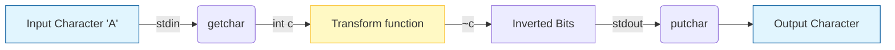
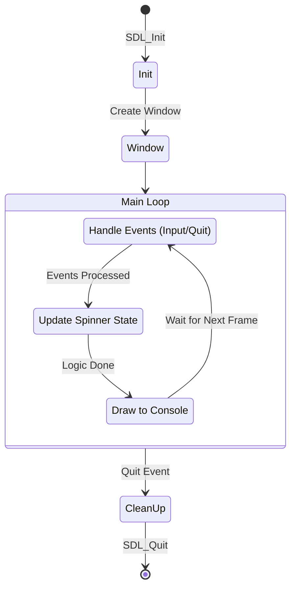

# C Learning Journey

Welcome to my C programming repository. This "book" documents my journey of learning C through practical projects. Each chapter dives into a specific project, explaining the concepts, code, and logic behind it.

## Index

*   [**Chapter 1: The Obfuscator**](./obfuscator) - A simple tool to scramble text using bitwise operations.
*   [**Chapter 2: SDL Experiment**](./sdl) - An exploration of graphics programming and window management.

---

## Chapter 1: The Obfuscator

### Overview
The **Obfuscator** is a minimal utility designed to understand how data can be manipulated at the bit level. It takes standard input, flips the bits of every character, and prints the result to standard output. This simple transformation makes the text unreadable to humans but easily reversible by running it through the same program again.

### Concept
This program demonstrates two core concepts:
1.  **Standard I/O**: Reading from `stdin` and writing to `stdout` allows the program to be part of a pipeline (e.g., `echo "hello" | ./main`).
2.  **Bitwise NOT (`~`)**: The tilde operator inverts all bits of a number. (e.g., `00001111` becomes `11110000`).

### Data Flow
The following diagram illustrates how a single character flows through the program:



### Code Walkthrough
Let's look at `obfuscator/main.c` line by line.

```c
1: #include <stdio.h>
```
**Line 1**: We include the Standard Input/Output library. This gives us access to `getchar`, `putchar`, and `EOF`.

```c
2:  int transform(int c){
3:     return ~c;
4:  }
```
**Lines 2-4**: The `transform` function is the core logic.
*   It takes an integer `c` (a character code).
*   It returns `~c` (bitwise NOT of `c`).
*   **Why `int`?** In C, `getchar` returns an `int` to accommodate the `EOF` (End of File) marker, which is -1.

```c
6:  int main(){
7:     int c;
8:     while((c=getchar()) != EOF){
9:         putchar(transform(c));
10:     }
11:  }
```
**Line 6**: The entry point of the program.
**Line 7**: We declare a variable `c` to hold each character.
**Line 8**: This is a classic C idiom: `while((c=getchar()) != EOF)`.
1.  `getchar()` reads one character from the input.
2.  `(c = ...)` assigns that character to `c`.
3.  `... != EOF` checks if we have reached the end of the input stream.
4.  The loop continues as long as there is data to read.
**Line 9**: `putchar(transform(c))` calculates the obfuscated character and prints it immediately.

---

## Chapter 2: SDL Starter

### Overview
This project is an initial experiment with **SDL2** (Simple DirectMedia Layer). Unlike the console-based obfuscator, this program creates a graphical window. However, since it's a "starter" project, it also keeps a foot in the terminal world by running an ASCII spinner in the console while the window is open.

### Application Loop
Game engines and UI applications typically run in an infinite loop that handles events, updates state, and renders graphics.



### Key Components (`sdl/main.c`)

*   **SDL Initialization**: `SDL_Init(SDL_INIT_VIDEO)` sets up the video subsystem.
*   **Window Creation**: `SDL_CreateWindow` opens the actual OS window with the title "ASCII Spinner".
*   **The Event Loop**:
    ```c
    while (SDL_PollEvent(&event)) {
        if (event.type == SDL_QUIT) { ... }
    }
    ```
    This non-blocking loop checks for user actions (like clicking the 'X' button) to ensure the application stays responsive.
*   **The Spinner**: The code manually refreshes the console output using ANSI escape codes (`\033[2J\033[H`) to clear the screen and print the next frame of the animation, creating a simple visual effect in the terminal alongside the empty SDL window.

---
*Happy Coding!*
