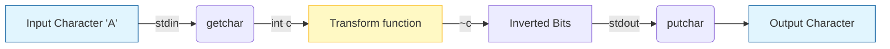
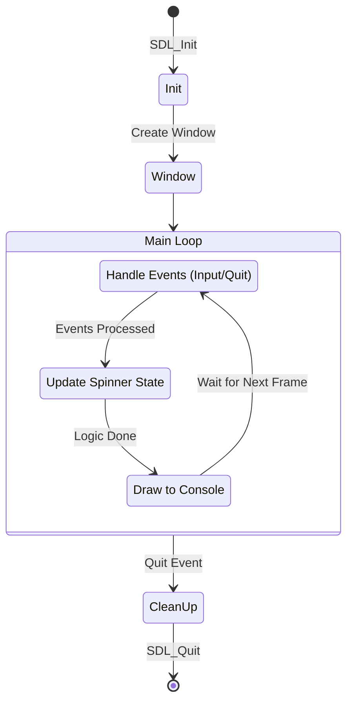
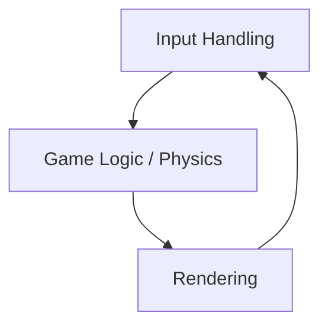
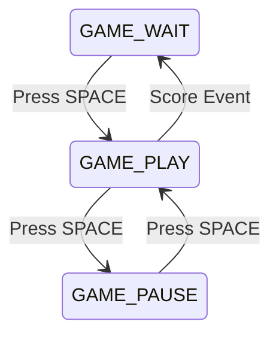
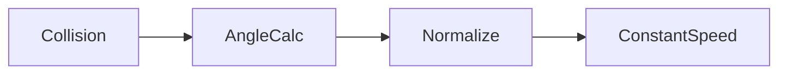
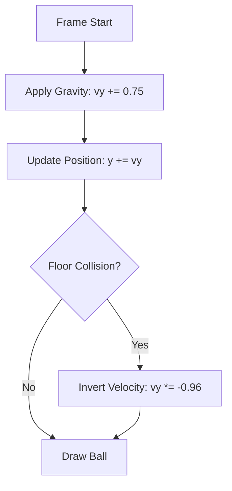

# C Learning Journey

Welcome to my C programming repository. This "book" documents my journey of learning C through practical projects. Each chapter dives into a specific project, explaining the concepts, code, and logic behind it.

## Index

*   [**Chapter 1: The Obfuscator**](./obfuscator) - A simple tool to scramble text using bitwise operations.
*   [**Chapter 2: SDL Experiment**](./sdl) - An exploration of graphics programming and window management.
*   [**Chapter 3: Ping Pong**](./Ping%20Pong) - A classic Pong game implemented from scratch.
*   [**Chapter 4: Bouncing Ball**](./BouncingBall) - Gravity simulation with visual trail effects.

---

## Chapter 1: The Obfuscator

### Overview
The **Obfuscator** is a minimal utility designed to understand how data can be manipulated at the bit level. It takes standard input, flips the bits of every character, and prints the result to standard output. This simple transformation makes the text unreadable to humans but easily reversible by running it through the same program again.

### Concept
This program demonstrates two core concepts:
1.  **Standard I/O**: Reading from `stdin` and writing to `stdout` allows the program to be part of a pipeline (e.g., `echo "hello" | ./main`).
2.  **Bitwise NOT (`~`)**: The tilde operator inverts all bits of a number. (e.g., `00001111` becomes `11110000`).

### Data Flow
The following diagram illustrates how a single character flows through the program:



### Code Walkthrough
Let's look at `obfuscator/main.c` line by line.

```c
1: #include <stdio.h>
```
**Line 1**: We include the Standard Input/Output library. This gives us access to `getchar`, `putchar`, and `EOF`.

```c
2:  int transform(int c){
3:     return ~c;
4:  }
```
**Lines 2-4**: The `transform` function is the core logic.
*   It takes an integer `c` (a character code).
*   It returns `~c` (bitwise NOT of `c`).
*   **Why `int`?** In C, `getchar` returns an `int` to accommodate the `EOF` (End of File) marker, which is -1.

```c
6:  int main(){
7:     int c;
8:     while((c=getchar()) != EOF){
9:         putchar(transform(c));
10:     }
11:  }
```
**Line 6**: The entry point of the program.
**Line 7**: We declare a variable `c` to hold each character.
**Line 8**: This is a classic C idiom: `while((c=getchar()) != EOF)`.
1.  `getchar()` reads one character from the input.
2.  `(c = ...)` assigns that character to `c`.
3.  `... != EOF` checks if we have reached the end of the input stream.
4.  The loop continues as long as there is data to read.
**Line 9**: `putchar(transform(c))` calculates the obfuscated character and prints it immediately.

---

## Chapter 2: SDL Starter

### Overview
This project is an initial experiment with **SDL2** (Simple DirectMedia Layer). Unlike the console-based obfuscator, this program creates a graphical window. However, since it's a "starter" project, it also keeps a foot in the terminal world by running an ASCII spinner in the console while the window is open.

### Application Loop
Game engines and UI applications typically run in an infinite loop that handles events, updates state, and renders graphics.



### Key Components (`sdl/main.c`)

*   **SDL Initialization**: `SDL_Init(SDL_INIT_VIDEO)` sets up the video subsystem.
*   **Window Creation**: `SDL_CreateWindow` opens the actual OS window with the title "ASCII Spinner".
*   **The Event Loop**:
    ```c
    while (SDL_PollEvent(&event)) {
        if (event.type == SDL_QUIT) { ... }
    }
    ```
    This non-blocking loop checks for user actions (like clicking the 'X' button) to ensure the application stays responsive.
*   **The Spinner**: The code manually refreshes the console output using ANSI escape codes (`\033[2J\033[H`) to clear the screen and print the next frame of the animation, creating a simple visual effect in the terminal alongside the empty SDL window.

---

## Chapter 3: Ping Pong

[**View Gameplay Demo on X 🚀**](https://x.com/PriyanshuS92042/status/2001981221052858504?s=20)

### Overview
**Pong in C using SDL2** is a classic Pong game implemented from scratch. This project was built to deeply understand low-level memory manipulation, pointers, real-time game loops, collision physics, and state-driven architecture.


### Features
*   **🎮 Two-player Pong** (keyboard controlled)
*   **⏯️ Start / Pause / Resume** game
*   **⏯️ Restart** game with score reset
*   **🧠 Constant-speed ball physics** (no speed bugs)
*   **🧱 Proper collision handling** (walls & paddles)
*   **📝 Text rendering** using SDL2_ttf
*   **🧩 Clean game-state architecture**

### Controls
| Key | Action |
| :--- | :--- |
| **W / S** | Player 1 paddle up / down |
| **↑ / ↓** | Player 2 paddle up / down |
| **SPACE** | Start / Pause / Resume |
| **X** | Restart game (reset score) |
| **ESC** | Quit |

### High-Level Architecture
The game is structured into three core phases, executed every frame. This separation ensures input doesn’t directly affect rendering and physics doesn’t run when paused.



### Game State System
The game uses a state machine to control behavior:



*   **GAME_WAIT**: Ball is reset, waiting to start.
*   **GAME_PLAY**: Physics and movement active.
*   **GAME_PAUSE**: Screen frozen, input still active.

### Technical Deep Dive
#### Memory & Pointer Design
This project intentionally uses **pointers** everywhere movement or state must persist.

```c
void move_paddle(SDL_Rect *p, int dy)
```

Passing by **value** would modify a copy. Passing a **pointer** modifies the actual object in memory. This is how real engines work at a low level: nothing "moves" on screen; numbers in memory change, and SDL draws those numbers.

#### Physics (Ball Movement)
The ball uses float-based velocity vectors to prevent speed bugs and inconsistent gameplay.



1.  **Angle Calculation**: Calculated based on where the ball hits the paddle.
2.  **Normalization**: The velocity vector is normalized.
3.  **Constant Speed**: Speed magnitude is restored to a constant value.

### File Structure
```
Ping Pong/
├── main.c        # Entire game logic
├── arial.ttf     # Font used for score rendering
├── pingpong.png  # Gameplay screenshot
└── pingpong.exe  # Generated buffer
```

### How to Build & Run (Step-by-Step)
**Windows (MSYS2 – MinGW64)**

1.  **Install dependencies**
    ```bash
    pacman -S mingw-w64-x86_64-SDL2 mingw-w64-x86_64-SDL2_ttf
    ```

2.  **Navigate to project folder**
    ```bash
    cd "Ping Pong"
    ```

3.  **Compile**
    ```bash
    gcc main.c -o pingpong $(pkg-config --cflags --libs sdl2 SDL2_ttf) -lm
    ```

4.  **Run**
    ```bash
    ./pingpong
    ```

> [!WARNING]
> Ensure `arial.ttf` is in the same folder as the executable, otherwise the game may not load the font.

---

## Chapter 4: Bouncing Ball

### Overview
**Bouncing Ball** is a physics simulation that models gravity and momentum. It renders a red ball that accelerates downwards, bounces off the floor with energy loss (restitution), and leaves a fading orange trail to visualize its path.

### Key Concepts

#### 1. Gravity & Physics
The simulation uses a simple Euler integration method:
*   **Gravity**: Constant acceleration added to velocity every frame.
*   **Restitution**: When hitting the floor, velocity is inverted and multiplied by `0.96f` to simulate energy loss (damping).



#### 2. Trail Effect (Visuals)
Instead of clearing the screen completely with black, we draw a semi-transparent black rectangle over the previous frame.
```c
SDL_SetRenderDrawColor(renderer, 0, 0, 0, 14); // Low alpha
SDL_RenderFillRect(renderer, NULL);
```
This causes previous positions of the ball to slowly fade out, creating a smooth "motion blur" or trail effect without storing a history of positions.

### Code Highlights (`BouncingBall/main.c`)

**Drawing the Circle (Manual Rasterization)**
Since SDL2 doesn't have a built-in `FillCircle`, we use the circle equation $x^2 + y^2 \le r^2$:
```c
for (int dy = -radius; dy <= radius; dy++) {
    for (int dx = -radius; dx <= radius; dx++) {
        if (dx*dx + dy*dy <= radius*radius) {
            SDL_RenderDrawPoint(renderer, x + dx, y + dy);
        }
    }
}
```

### How to Build & Run
**Windows (MSYS2 – MinGW64)**

1.  **Navigate to project folder**
    ```bash
    cd "BouncingBall"
    ```

2.  **Compile**
    ```bash
    gcc main.c -o bouncingball $(pkg-config --cflags --libs sdl2)
    ```

3.  **Run**
    ```bash
    ./bouncingball
    ```

---
*Happy Coding!*
